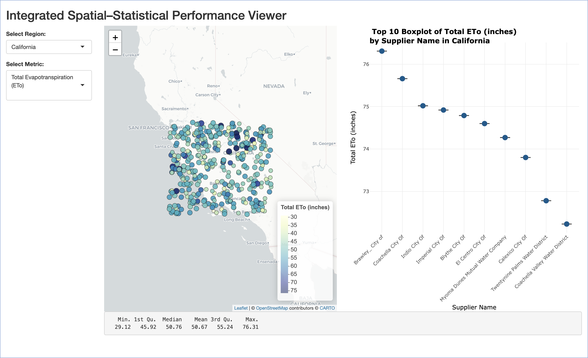

# 💧 Water Resource Visualisation

## 📌 Project Overview

This project presents an interactive visualisation dashboard for **water resource sustainability and performance evaluation** across **California**, **Utah**, and **New York City**. It was developed as part of the **Data Visualisation Project (DVP2)** for FIT5147 at Monash University.

Using `R Shiny`, the app allows users to explore spatial and statistical indicators interactively through dropdowns, maps, and plots—supporting data-driven decision-making in water management and urban planning.

---

## 🎯 Project Objectives

- Highlight regional water usage patterns and irrigation methods
- Compare evapotranspiration and precipitation metrics across suppliers
- Visualise energy efficiency of buildings using ENERGY STAR scores
- Provide integrated spatial and statistical analysis for better insights

---

## 🗂️ Repository Contents

| File | Description |
|------|-------------|
| `DVP2_FIT5147_code.R` | Main Shiny app script (R) |
| `DVP_visualisation.png` | Sample dashboard screenshot showing map and boxplot |
| `README.md` | This documentation file |

---

## 📊 Key Visualisation Example



This figure demonstrates the **California dashboard** when the user selects:

- **Region**: California  
- **Metric**: Total Evapotranspiration (ETo)

**Left Panel – Map:**
- Each dot represents a water supplier, color-coded by ETo values
- Interactive tooltips and color scale help explore spatial differences

**Right Panel – Boxplot:**
- Top 10 suppliers with highest ETo are plotted
- Points overlay boxplots to highlight mean, variation, and outliers

**Below – Five-number Summary:**
- Descriptive statistics include min, 1st quartile, median, mean, 3rd quartile, and max ETo

This interface helps users compare regional performance interactively using spatial and statistical perspectives.

---

## 🧪 How to Run the App

1. Ensure all `.csv` files (datasets) are in the same directory as the `.R` script.
2. Open the `DVP2_FIT5147_code.R` file in RStudio.
3. Run the app using the command:

```r
shiny::runApp("DVP2_FIT5147_code.R")
